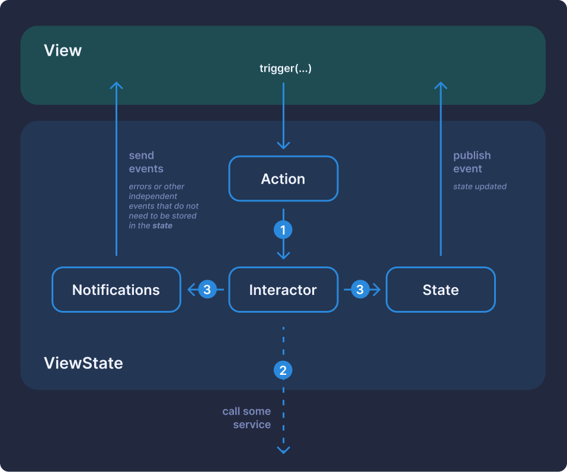

# View - ViewState - Interactor (VVSI)

VVSI is an experimental (very) simple architecture for SwiftUI applications, representing something between [TCA](https://github.com/pointfreeco/swift-composable-architecture) (The Composable Architecture) and [MVVM](https://en.wikipedia.org/wiki/Model%E2%80%93view%E2%80%93viewmodel). The library offers a structured and predictable approach to managing state and business logic, while maintaining ease of use.

## 📊 Architecture Diagram



## 🌟 Benefits

- **Separation of concerns** — clear separation of UI, state, and business logic
- **Predictable data flow** — unidirectional data flow makes the application more stable
- **Testability** — isolated components are easy to test
- **Out-of-the-box asynchronicity** — support for asynchronous operations using Swift Concurrency
- **Native SwiftUI integration** — works naturally with the SwiftUI system

## 📦 Installation

### Swift Package Manager

```swift
dependencies: [
    .package(url: "https://github.com/username/VVSI.git", from: "0.0.5")
]
```

## 🚀 How to Use

VVSI consists of three main components:

1. **View** — responsible for UI and state display
2. **ViewState** — stores the current state and processes actions
3. **Interactor** — contains business logic and handles side effects

### Example: Simple List

#### 1. Create state and action components

```swift
// ListView+State.swift

extension ListView {

    struct Options {
        let count: Int
        let length: Int
    }

    struct VState: StateProtocol {
        var items: [String] = []
    }

    enum VAction: ActionProtocol {
        case add
        case remove
        case random(Options)
    }

    enum VNotification: NotificationProtocol {
        case error(String)
    }
}
```

#### 2. Implement the interactor to handle business logic

```swift
// ListView+Interactor.swift

extension ListView {

    final class Interactor: ViewStateInteractorProtocol {

        typealias S = VState
        typealias A = VAction
        typealias N = VNotification

        let notifications: PassthroughSubject<N, Never> = .init()
        let service: Dependencies.Service

        init(dependencies: Dependencies = .shared) {
            service = dependencies.service
        }

        @MainActor
        func execute(
            _ state: @escaping CurrentState<S>,
            _ action: VAction,
            _ updater: @escaping StateUpdater<S>
        ) {
            switch action {
            case .add:
                Task.detached { [weak self] in
                    guard await state().items.count < 5 else {
                        self?.notifications.send(.error("Max items count is 5"))
                        return
                    }

                    await updater { state in
                        state.items.append("New item")
                    }
                }

            case .remove:
                Task.detached {
                    await updater { state in
                        if !state.items.isEmpty {
                            state.items.removeLast()
                        }
                    }
                }
            case .random(let opt):
                Task {
                    let strings = (0..<opt.count).map { _ in randomString(length: opt.length) }
                    await updater { state in
                        state.items = strings
                    }
                }
            }
        }
    }
}
```

#### 3. Create a view that uses ViewState

```swift
// ListView.swift

struct ListView: View {

    enum AlertType: Identifiable {
        var id: String { "\(self)" }
        case error(String)
    }

    @StateObject
    var viewState = ViewState(.init(), Interactor())

    @State
    private var alertType: AlertType? = nil

    var body: some View {
        ForEach(viewState.state.items, id: \.self) { item in
            Text(item)
        }

        HStack {
            Button {
                viewState.trigger(.add)
            } label: {
                Text("Add")
            }

            Button {
                viewState.trigger(.remove)
            } label: {
                Text("Remove")
            }
            Button {
                viewState.trigger(.random(.init(count: Int.random(in: 1..<10), length: Int.random(in: 1..<5))))
            } label: {
                Text("Random")
            }
        }
        .alert(item: $alertType) { item in
            switch item {
            case .error(let error):
                Alert(
                    title: Text("Error"),
                    message: Text(error),
                    dismissButton: .default(Text("Ok"))
                )
            }
        }
        .onReceive(viewState.notifications) { notification in
            switch notification {
            case .error(let message):
                alertType = .error(message)
            }
        }
    }
}
```

## 🧩 Core Concepts

- **StateProtocol** — protocol for state structures
- **ActionProtocol** — protocol for action enumerations
- **NotificationProtocol** — protocol for notifications from interactor to view
- **ViewStateInteractorProtocol** — protocol for interactors handling business logic

## 📚 Complete Example

A complete implementation example is available in the [VVSIExample](/VVSIExample) directory.

## 📄 License

This project is released under the MIT license. See [LICENSE](/LICENSE) for details.

## 👥 Contributors

We welcome your suggestions and contributions to the project! Create Issues and Pull Requests.
